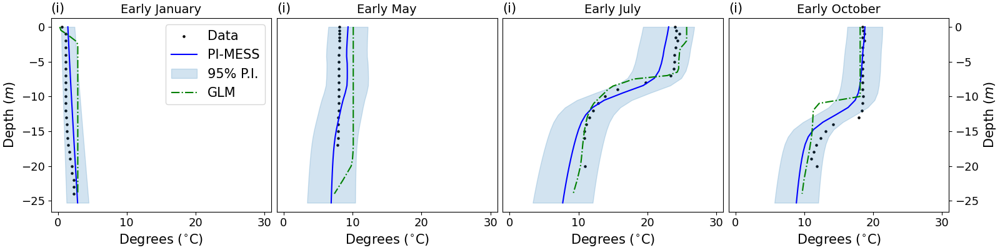
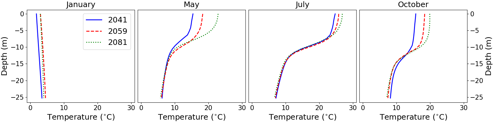

# Supplemental codes for "A Spatiotemporal Physics-Informed State-Space Model of Lake Temperature Profiles"

## Data Setup and Running the Code

1. **Download the data**

   All required datasets can be obtained from the [USGS ScienceBase repository](#references). The figure below shows the spatial distribution of lakes as well as two representative lakes (one deep and one shallow). Deep lakes exhibit seasonality in the form of a stratified profile in the summer months and a fully-mixed profile otherwise. Shallow lakes do not mix, as the profile tends to remains uniform.
   
   

3. **Organize the data files**

   After downloading, organize the files within the `data` directory as follows:
   - `data/GCM` — contains **climate projection files**;
   - `data/meteo_csv_files` — contains **ALL NLDAS weather files**;  
   - Any remaining data files may be placed directly in the `data` directory.
  
4. **Train the PI-MESS model**

   The user should first create the training and testing datasets by running the create_training_dataset.py script. Then, run the `train_model.py` script. At the top of the `train_model.py` script, the toggle ''suffix'' controls which type of model is trained:
   - 'MOE' for the PI-MESS model;
   - 'PINN' for the PINN model;
   - 'NPI' for the NN model.
     
   Default is PI-MESS. This will save the chosen model inside the `models` directory within the `code` directory. The figure below shows an illustration of the PI-MESS model architecture.

   

6. **Generate predictions**

   The model can be used to generate predictions over the contemporary period (up to 2022) or into the future. Climate projections (included in the data release) are available 2041-2059 and 2080-2099.
   - Run `predict_contemporary.py` for contemporary period predictions;
   - Run `forecast.py` for future predictions.

  The figures below show predictions (over the validtion period 2016-2022) and projections for Lake Mendota, WI. In the predictions figure we show results from a General Lake Model (GLM), as described by [Hipsey et al. (2019)](#references), for comparison purposes with PI-MESS.
  
   

   

## References

1. Corson-Dosch, H. R., Mcaliley, W. A., Platt, L. R. C., Padilla, J. A., & Read, J. S. (2023). *Daily Water Column Temperature Predictions for Thousands of Midwest U.S. Lakes Between 1979–2022 and Under Future Climate Scenarios*. [https://doi.org/10.5066/P9EQQER7](https://doi.org/10.5066/P9EQQER7)
2. Hipsey, M. R., Bruce, L. C., Boon, C., Busch, B., Carey, C. C., Hamilton, D. P., Hanson, P. C., Read, J. S., de Sousa, E., Weber, M., & Winslow, L. A. (2019). *A General Lake Model (GLM 3.0) for linking with high‑frequency sensor data from the Global Lake Ecological Observatory Network (GLEON)*. Geoscientific Model Development, 12(1), 473‑523. [https://doi.org/10.5194/gmd-12-473-2019](https://doi.org/10.5194/gmd-12-473-2019)

